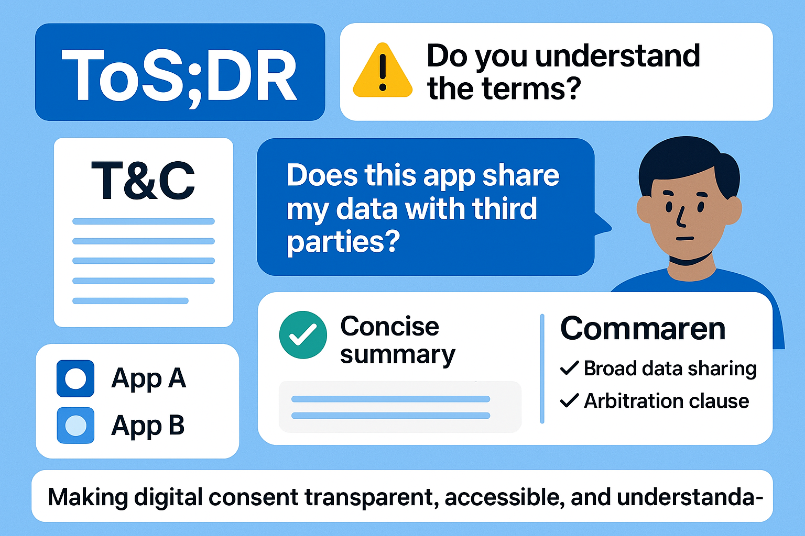
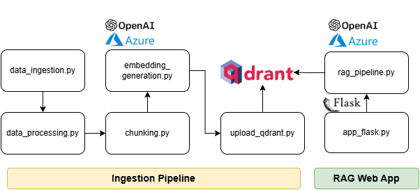
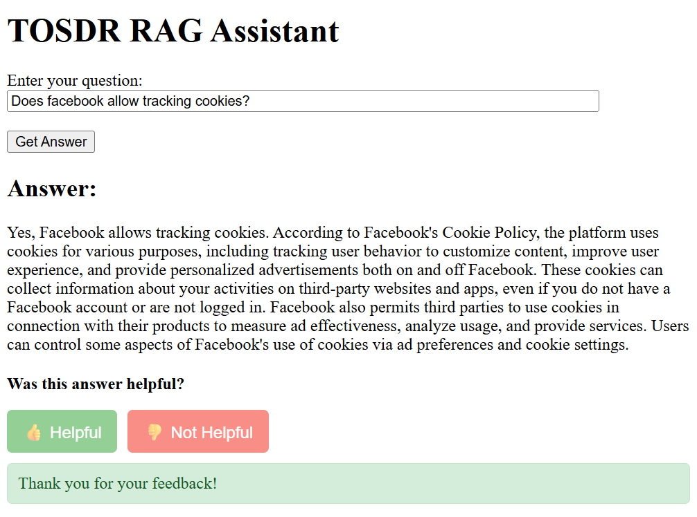

# 🧩 ToSDR-RAG: Understanding Terms & Conditions through RAG



## 📖 Problem Description

Most people never read the **Terms & Conditions** or **Privacy Policies** when signing up for online services.  
These documents are often **long, complex, and full of legal jargon**, making it difficult for users to understand what rights they might be giving up or what data might be collected about them.

As a result, users routinely agree to policies that:
- Allow broad data sharing or tracking,
- Contain hidden clauses about arbitration, liability, or data retention,
- Differ significantly between companies without users realizing it.

This project addresses this problem by building a **Retrieval-Augmented Generation (RAG)** system based on the **Terms of Service; Didn’t Read** dataset that allows users to:
- **Ask natural language questions** (e.g., “Does this app share my data with third parties?”)
- **Compare multiple services** side by side based on their terms or privacy policies
- **Get concise, LLM-generated summaries** that highlight potential risks or user rights.

By doing so, ToSDR-RAG aims to make digital consent **transparent, accessible, and understandable**, empowering users to make informed choices about the services they use.

## 🧭 RAG Architecture Overview


*Figure: High-level flow diagram of data ingestion and retrieval-augmented generation (RAG) web app.*

---

### ⚙️ Automated Ingestion Pipeline

The ingestion pipeline prepares the ToSDR dataset for retrieval.  It pulls the data, processes, chunks, embeds, and uploads all document chunks into a embedded Qdrant vector database (via `qdrant-client[fastembed]`).

#### 🧩 Scripts Overview

- **`data_ingestion.py`**
  - Loads the raw ToS;DR corpus (Terms of Service; Didn’t Read) via [Kaggle](https://www.kaggle.com/datasets/sonu1607/tosdr-terms-of-service-corpus).
  - Organizes the files into a local directory under `data/raw/`.
  - Ensures consistent encoding and file structure for downstream processing.

- **`data_processing.py`**
  - normalizes text content into JSON format.
  - Removes unwanted symbols, HTML tags, or metadata.
  - Outputs clean text files into `data/processed/`.

- **`chunking.py`**
  - Splits large documents into smaller chunks for embedding and retrieval.
  - Each chunk is associated with metadata such as source filename and chunk index and includes overlaps for better context.
  - Saves chunked data as JSONL format into `data/chunked/`.

- **`embedding_generation.py`**
  - Generates vector embeddings for each text chunk using **Azure OpenAI’s `text-embedding-3-small`** embedding model.
  - Batch processing and automatic retries in case of missing generated embeddings
  - Stores output in JSONL format with fields:
    - `id` — unique chunk identifier  
    - `source` — original document name  
    - `content` — text chunk  
    - `embedding` — vector representation

- **`upload_qdrant.py`**
  - Initializes an **embedded Qdrant instance** (local, no Docker required).
  - Creates a Qdrant collection (`tosdr_docs`).
  - Uploads embeddings and document content into the vector store as payloads.
  - Persists Qdrant data locally under `data/qdrant_data/`.

You can run the whole ingestion flow with::
```bash
./shell-scripts/run_ingestion.sh
```

---

### 💬 RAG Flask Web App

The web app allows users to ask questions about Terms of Service or Privacy Policies of given company or service and allows user to provide feedback on the quality of the response
Behind the scenes, it uses the local Qdrant database for search and retrieval, and Azure OpenAI GPT-4o model for reasoning. The user feedback is logged for monitoring.

#### 🧠 Components

- **`rag_pipeline.py`**
  - Implements the core RAG logic:
    1. Embeds the user query using Azure OpenAI.
    2. Retrieves the top 3 most relevant chunks from Qdrant.
    3. Builds a structured prompt combining sources and content.
    4. Calls the GPT model (`gpt-4o`) to generate a concise, grounded answer.

- **`app_flask.py`**
  - Serves a simple web interface built with Flask.
  - Users can input questions and view the AI-generated answers.
  - Integrates directly with `rag_pipeline.py` for inference.

You can run the flask app via the following command:
```bash
python src/app_flask.py
```

---

## 🧪 Evaluation

The scripts used for evaluation can be found under the `eval` folder.

### 1️⃣ Retrieval Evaluation

This section covers the evaluation of document retrieval quality using both vector search and hybrid search approaches.

- **`retrieval_eval_ground_truth_generation.py`**
  - Generates ground-truth data for evaluation.
  - Combines LLM and manual review to ensure accuracy.
  - Produces a JSON file (`retrieval_eval_ground_truth.json`) containing queries and corresponding ground-truth answer IDs.

- **`retrieval_eval.py`**
  - Computes **hit rate at top 5 documents** for retrieval performance.
  - Supports two evaluation approaches:
    1. **Vector search** – pure semantic similarity using embeddings.
    2. **Hybrid search** – combines semantic embeddings and keyword/text matching.
  - Allows comparison of retrieval quality across different methods.


Both approaches have ~89% Hit Rate@5.

---

### 2️⃣ LLM Evaluation

This section evaluates the relevance of answers generated by the RAG pipeline using an LLM-as-a-judge approach for two models, `gpt-4o` and `gpt-4o-mini`.

- **`llm_eval.py`**
  - Uses LLMs to judge whether the generated answer is relevant to the query.
  - Evaluates using two Azure OpenAI models: **`gpt-4o`** and **`gpt-4o-mini`**.
  - Takes queries from `retrieval_eval_ground_truth.json` and generates answers on the fly using the RAG pipeline.
  - Saves LLM judgement results in JSON format for further analysis.

---

## 📈 Monitoring

The ToSDR-RAG system includes **user feedback collection** and **monitoring capabilities** to track answer quality and user satisfaction over time.

### 🎯 User Feedback Collection


*Figure: User feedback buttons (👍 Helpful / 👎 Not Helpful) appear after each generated answer*

- **Real-time Feedback Collection**
  - Users can provide thumbs up/down feedback on each generated answer
  - Feedback is collected via AJAX requests without page refresh
  - Buttons are disabled after submission to prevent duplicate feedback

- **Local Data Storage**
  - All feedback is logged to `logs/feedback.jsonl` in JSON Lines format
  - Each entry includes:
    - **Timestamp** — when feedback was submitted
    - **Query** — original user question
    - **Answer** — generated RAG response
    - **Rating** — user rating (`thumbs_up` or `thumbs_down`)

### 📈 Feedback Dashboard

A comprehensive dashboard script provides insights into user satisfaction and system performance.

- **`feedback_dashboard.py`**
  - Displays summary statistics (total feedback, rating distribution, date ranges)
  - Shows recent feedback entries with query previews
  - Calculates satisfaction percentages for quick quality assessment
  - Supports data export options for further analysis

#### Dashboard Usage

```bash
# View feedback summary and recent entries
python src/feedback_dashboard.py

# Export all feedback data to CSV
python src/feedback_dashboard.py --export-csv

# View detailed feedback with full queries and answers
python src/feedback_dashboard.py --detailed
```

#### Sample Dashboard Output
```
============================================================
FEEDBACK DASHBOARD SUMMARY
============================================================
Total feedback entries: 15
👍 Thumbs up: 12 (80.0%)
👎 Thumbs down: 3 (20.0%)
Feedback date range: 2025-10-18 to 2025-10-18
```

This monitoring system enables **continuous improvement** of the RAG pipeline by:
- Identifying common user satisfaction patterns
- Detecting queries that consistently receive negative feedback
- Providing data for model fine-tuning and prompt optimization
- Supporting A/B testing of different RAG configurations

---

## Containerization and Reproducibility

ToSDR-RAG  ensures **environment consistency**, **dependency management**, and **reproducibility** using Docker.

### Project Structure for Containerization

- **`Dockerfile.app`**  
  - Builds the container for the main RAG application.
  - Installs all necessary dependencies and sets up the runtime environment for executing RAG queries and generating answers.

- **`Dockerfile.ingestion`**  
  - Builds the container for the **data ingestion pipeline**.
  - Handles downloading, processing, and preparing the raw dataset for embeddings generation and uploading to Qdrant.

- **`docker-compose.yml`**  
  - Orchestrates the two containers for the project.  
  - Enables running the full pipeline locally with a single command:  
    ```bash
    docker-compose up --build
    ```
  - Ensures containers communicate properly and share volumes as needed for data persistence.

- **`requirements.txt`**  
  - Lists all Python dependencies required by both the ingestion and RAG application containers.  
  - To install the dependencies, run
  ```bash
  pip install -r requirements.txt
  ```

### Quick Start

1. Build and start all containers:
   ```bash
   docker-compose up --build
   ```

## 🧱 Future Enhancements
 
- Add streaming responses or citations in the web UI.  
- Integrate **Azure Cognitive Search** or a **remote Qdrant server** for scalability.

## 🙏 Acknowledgements

This project is part of the capstone project for the **[LLM Zoomcamp](https://github.com/DataTalksClub/llm-zoomcamp)** Course. I thank the instructors and DataTalks.Club for making the learning content available.

The dataset used in this project was sourced from the **[ToS;DR Corpus](https://www.kaggle.com/datasets/sonu1607/tosdr-terms-of-service-corpus)** on Kaggle.

